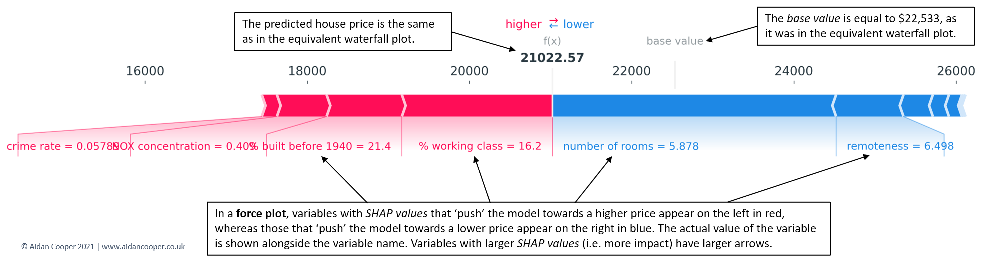
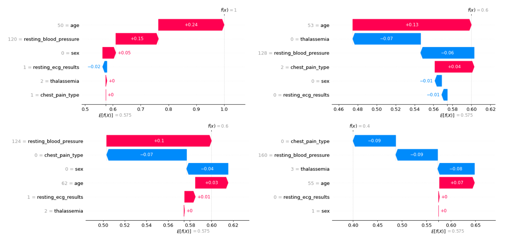
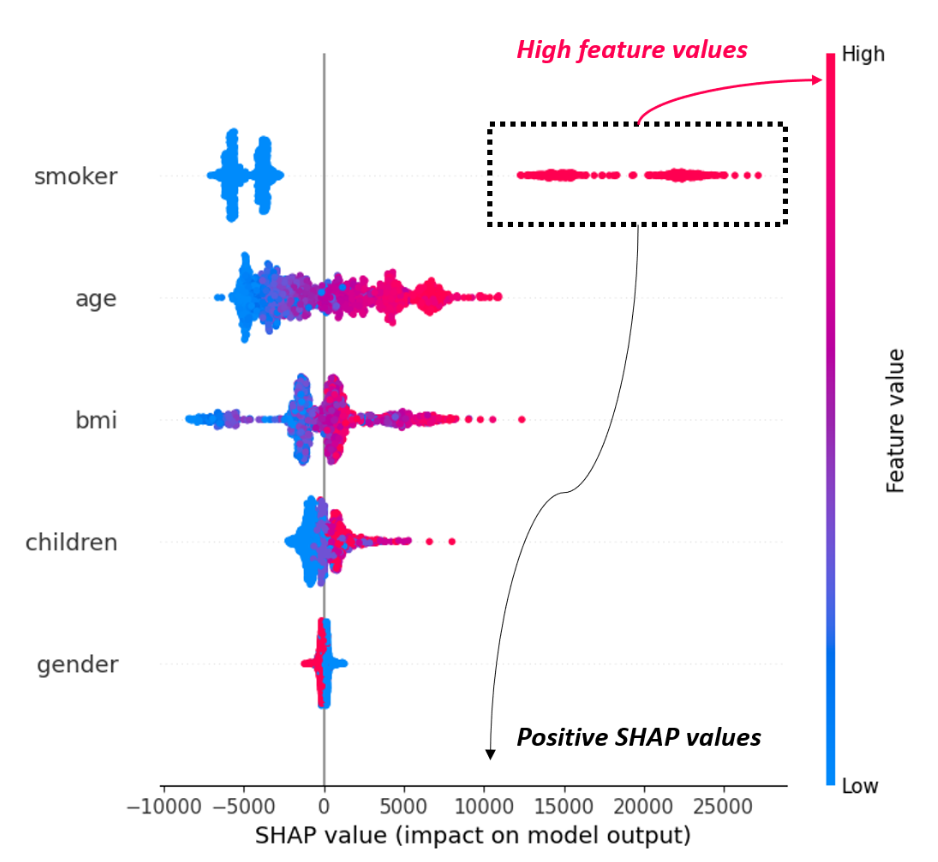
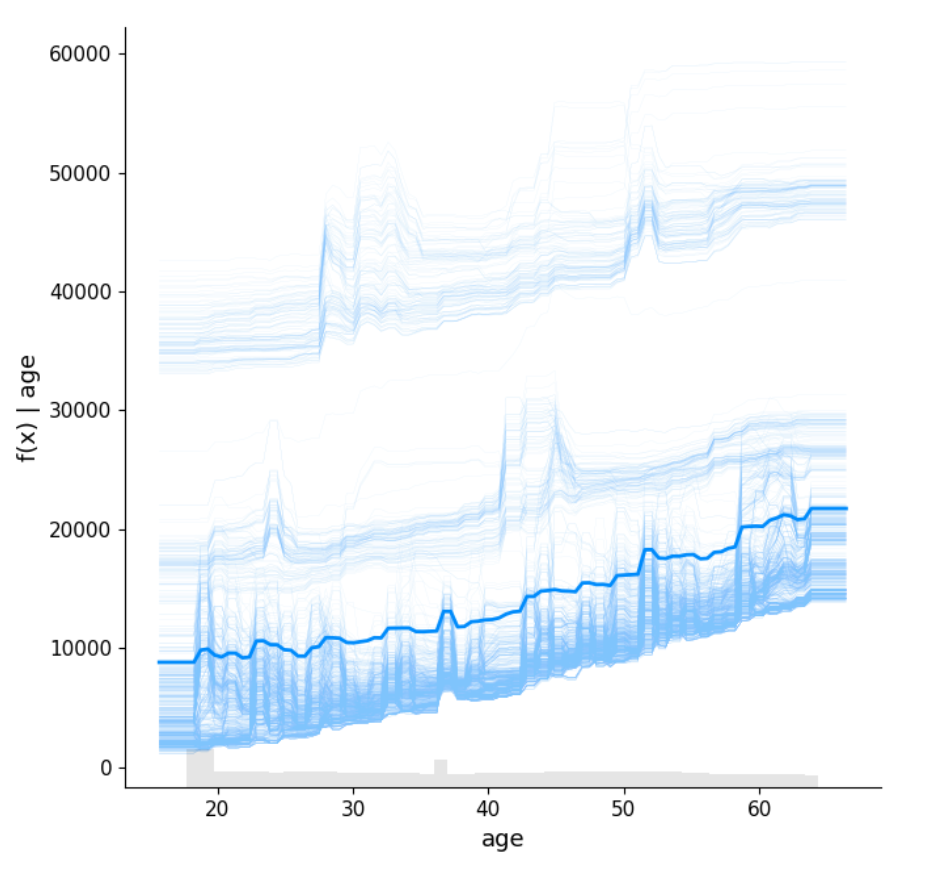
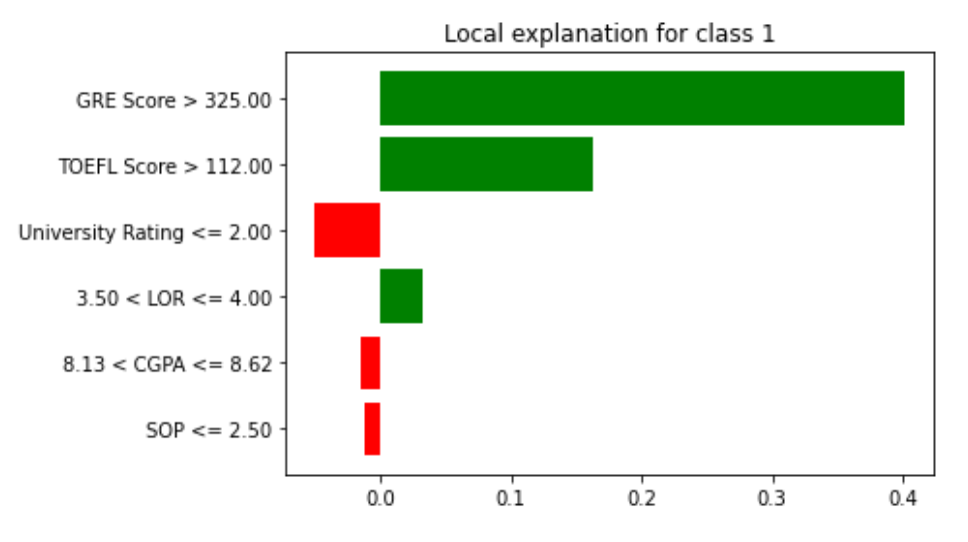
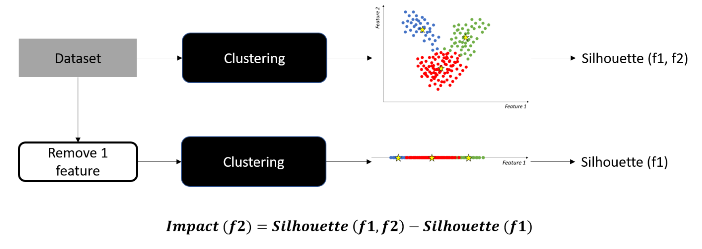
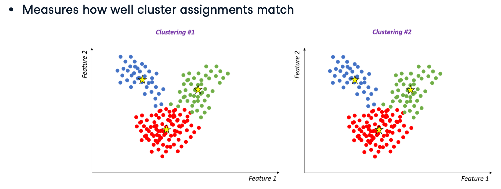

# Explainable AI in Python: Demystifying Black Boxes with SHAP, LIME, and Beyond

Machine learning models are often criticized as “black boxes” whose inner workings are difficult to understand. In high-stakes domains like healthcare, finance, and criminal justice, however, interpretability is not just a luxury—it’s a necessity. In this post, we explore how to bring transparency to your models using Explainable AI (XAI). We’ll start with the basics of interpretable models, progress through model-agnostic and local explanation techniques (including LIME), and then dive deep into the theory and practice of SHAP—an approach that combines the fairness of game theory with intuitive visualizations.

## Table of Contents

1. [The Foundations: Why Explainability Matters](#1-the-foundations-why-explainability-matters)
2. [Model-Agnostic Explainability: Interpreting Any Model](#2-model-agnostic-explainability-interpreting-any-model)
3. [Understanding SHAP: Theory, Intuition, and Visualization](#3-understanding-shap-theory-intuition-and-visualization)
4. [Choosing Between Tree and Kernel Explainers](#4-choosing-between-tree-and-kernel-explainers)
5. [Local Explainability with LIME](#5-local-explainability-with-lime)
6. [Advanced Topics: Consistency, Faithfulness, and Unsupervised Explanations](#6-advanced-topics-consistency-faithfulness-and-unsupervised-explanations)
7. [Conclusion](#conclusion)
8. [Further Reading](#further-reading)

---

## 1. The Foundations: Why Explainability Matters

Before diving into the code, let’s discuss why interpretability is critical:

- **Trust and Accountability:** Transparent models help stakeholders understand and trust AI decisions.
- **Debugging and Improvement:** Interpretable models allow you to diagnose errors, reduce bias, and fine-tune performance.
- **Regulatory Compliance:** Many industries require that decisions be explainable, ensuring that models meet ethical and legal standards.

### Inherently Interpretable Models

Some models are designed to be interpretable. For example, decision trees expose their decision rules, and linear or logistic regression models make it clear how each feature contributes through their coefficients.

#### Example: Decision Trees for Classification

Below is an example of using a decision tree for classification. We train the model, print its decision rules, and evaluate its accuracy:

```python
from sklearn.tree import DecisionTreeClassifier, export_text
from sklearn.metrics import accuracy_score

# Train a decision tree classifier with a fixed random state and limited depth for simplicity.
model = DecisionTreeClassifier(random_state=42, max_depth=2)
model.fit(X_train, y_train)

# Export and print the decision rules to see which features and thresholds are used.
rules = export_text(model, feature_names=list(X_train.columns))
print("Decision Tree Rules:\n", rules)

# Predict and compute accuracy to evaluate model performance.
y_pred = model.predict(X_test)
accuracy = accuracy_score(y_test, y_pred)
print(f"Accuracy: {accuracy:.2f}")

# Derive feature importances
feature_importances = model.feature_importances_
feature_names = X_train.columns

# Plot the feature importances
plt.barh(feature_names, feature_importances)
plt.show()
```

*The decision rules reveal exactly which features and thresholds drive the predictions.*

#### Example: Linear and Logistic Regression with Visualization

The following code demonstrates how linear and logistic regression models can provide interpretability through their coefficients. We also use simple visualizations to illustrate feature importance:

```python
from sklearn.preprocessing import MinMaxScaler
from sklearn.linear_model import LinearRegression, LogisticRegression
import matplotlib.pyplot as plt

# Scale the training data to a 0-1 range for stability in regression.
scaler = MinMaxScaler()
X_train_scaled = scaler.fit_transform(X_train)

# Linear Regression example: Train the model and extract coefficients.
lin_model = LinearRegression()
lin_model.fit(X_train_scaled, y_train)
lin_coefficients = lin_model.coef_

plt.figure(figsize=(8, 4))
plt.bar(X_train.columns, lin_coefficients)
plt.title('Linear Regression Coefficients')
plt.xlabel('Features')
plt.ylabel('Coefficient Value')
plt.show()

# Logistic Regression example: Train the model and plot coefficients.
log_model = LogisticRegression()
log_model.fit(X_train_scaled, y_train)
log_coefficients = log_model.coef_[0]

plt.figure(figsize=(8, 4))
plt.bar(X_train.columns, log_coefficients)
plt.title('Logistic Regression Coefficients')
plt.xlabel('Features')
plt.ylabel('Coefficient Value')
plt.show()
```

*These visualizations help you quickly grasp the influence of each feature in the prediction process.*

---

## 2. Model-Agnostic Explainability: Interpreting Any Model

Not all models are naturally transparent. For more complex models—like deep neural networks—model-agnostic techniques enable us to understand predictions without delving into the model’s internals. One such method is **permutation importance**.

### Permutation Importance

Permutation importance is a straightforward technique that quantifies the contribution of each feature by observing the effect on model performance when that feature’s values are randomly shuffled. The following table provides a concise overview of the process:

| **Step**                     | **Description**                                                                                                                                                  |
|------------------------------|------------------------------------------------------------------------------------------------------------------------------------------------------------------|
| **1. Baseline Performance**  | Evaluate the model on a test set to establish a performance baseline (e.g., accuracy).                                                                            |
| **2. Feature Shuffling**     | For each feature, randomly shuffle its values in the test set to break its relationship with the target.                                                         |
| **3. Performance Recalculation** | Re-measure the model’s performance on the modified data.                                                                                                     |
| **4. Importance Calculation**| Calculate the drop in performance compared to the baseline. A larger drop indicates a more influential feature. Repeat the process for robust estimates.       |

In the following figures, we observe the effect of permuting features on the correlation between the feature and the target and consequently on the model statistical performance.


We observe that permuting a predictive feature breaks the correlation between the feature and the target, and consequently the model statistical performance decreases. Correspondingly, if we permute a non-predictive feature, we do not expect it to significantly degrade the model performance.

#### Example: Permutation Importance with a Neural Network

The following example demonstrates how to compute and visualize permutation importance for an MLP classifier:

```python
from sklearn.neural_network import MLPClassifier
from sklearn.inspection import permutation_importance
import matplotlib.pyplot as plt

# Train an MLP classifier (a type of neural network) with a fixed random state.
model = MLPClassifier(hidden_layer_sizes=(10,), random_state=1)
model.fit(X, y)

# Compute permutation importance: n_repeats=10 ensures stability, and random_state fixes the shuffling.
result = permutation_importance(model, X, y, n_repeats=10, random_state=1, scoring="accuracy")

# Plot the mean importance for each feature.
plt.figure(figsize=(8, 4))
plt.bar(X.columns, result.importances_mean)
plt.xticks(rotation=45)
plt.title('Permutation Importance')
plt.xlabel('Features')
plt.ylabel('Mean Importance')
plt.show()
```

In this example, shuffling each feature’s values and observing the impact on accuracy provides a direct measure of feature importance. Permutation importance thus offers a powerful, model-agnostic tool for interpreting even the most complex models.

---

## 3. Understanding SHAP: Theory, Intuition, and Visualization

SHAP (SHapley Additive exPlanations) is a powerful tool that explains individual predictions by fairly distributing the “credit” among all features. Before diving into code examples, let’s review its theoretical basis.

### 3.1 Theoretical Foundation: The Shapley Value

At the core of SHAP lies the **Shapley value** from cooperative game theory. Suppose a model uses a set of features $N$. The contribution of a feature $i$ to the prediction for an observation $x$ is given by:

$$
\phi_i(x) = \sum_{S \subseteq N \setminus \{i\}} \frac{|S|!(|N| - |S| - 1)!}{|N|!} \left[ f_{S \cup \{i\}}(x_{S \cup \{i\}}) - f_S(x_S) \right]
$$

**Breaking Down the Formula:**

- **Summing Over Subsets:**  
  The sum runs over all possible subsets $S$ of features that exclude $i$. Each $S$ represents a different “context” in which $i$ might be added.
  
- **Combinatorial Weight:**  

$$
\frac{|S|!(|N| - |S| - 1)!}{|N|!}
$$
  
  - $|S|!$ counts the number of orderings for features in $S$.
  - $(|N| - |S| - 1)!$ counts the orderings for the remaining features (excluding $i$).
  - $|N|!$ is the total number of orderings for all features.
  
  *Intuition:* This fraction represents the probability that, in a random ordering, exactly the features in $S$ come before $i$.

- **Marginal Contribution:**  

$$
f_{S \cup \{i\}}(x_{S \cup \{i\}}) - f_S(x_S)
$$
  
  This measures how much the model's prediction changes when feature $i$ is added.

**Key Takeaways:**

- The Shapley value fairly distributes the “credit” for the prediction across all features.
- The contributions are additive: the base value plus all $\phi_i$ sum to the model’s final prediction.

### 3.2 Intuitive Explanation

- **Cooperative Game Analogy:**  
  Imagine a game where the final payout is the model’s prediction and each feature is a “player.” The Shapley value tells you how much each player contributed.
  
- **Random Orderings:**  
  Considering all possible orderings ensures every possible context is evaluated.
  
- **Local Explanations:**  
  SHAP computes a contribution for every feature per observation, forming a matrix of shape [ {*num_observations*}, {*num_features*} ].

### 3.3 SHAP Visualization Options

SHAP offers several visualization tools to help interpret predictions. The options are divided into **local explanations** (focusing on individual predictions) and **global explanations** (providing an overall view of feature importance). Below is a table summarizing these options:

| **Visualization Option**    | **Type**  | **Description**                                                                                             | **Best Suited For**                                             |
|-----------------------------|-----------|-------------------------------------------------------------------------------------------------------------|-----------------------------------------------------------------|
| **Force Plot**              | Local     | Visualizes how individual features “push” the prediction from a base value to the final output.             | Explaining a single prediction interactively.                   |
| **Waterfall Plot**          | Local     | Provides a step-by-step breakdown of how each feature’s contribution accumulates from the baseline to the prediction. | Detailed, instance-level explanations.                          |
| **Summary (Beeswarm) Plot** | Global    | Aggregates SHAP values across all observations, showing the overall distribution and importance of features.   | Identifying the most influential features and understanding their general effects. |
| **Dependence Plot**         | Global    | Plots a feature’s SHAP values against its actual values to reveal non-linear effects and interactions.         | Analyzing individual feature effects across the dataset.         |
| **Decision Plot**           | Global    | Visualizes the cumulative effect of features on predictions, tracking how contributions accumulate.            | Comparing feature contributions over multiple observations.      |

*Local explanations (Force and Waterfall plots) are ideal when you need to understand why a particular prediction was made. Global explanations (Summary, Dependence, and Decision plots) help in understanding overall model behavior and identifying systematic trends.*

### 3.4 SHAP in Practice: Detailed Code Examples

Below are concise code examples showcasing key SHAP visualizations for both local and global explanations.

#### 3.4.1 Force Plot (Local Explanation)

```python
import shap

# Create a SHAP Tree Explainer (optimized for tree-based models)
explainer = shap.TreeExplainer(model)

# Compute SHAP values for the dataset X
shap_values = explainer.shap_values(X)

# Generate an interactive force plot for the first observation.
# - 'explainer.expected_value' is the base value (average prediction).
# - 'shap_values[0]' contains the contributions for the first instance.
# - 'X.iloc[0, :]' passes the feature values for the first instance.
shap.force_plot(explainer.expected_value, shap_values[0], X.iloc[0, :], matplotlib=True)
```


#### 3.4.2 Waterfall Plot (Local Explanation)

```python
# Generate a waterfall plot to show how features increase or decrease predictions
# relative to baseline (model's average prediction across all samples)
shap.waterfall_plot(
  shap.Explanation(
    values=shap_values[:,1],
    base_values=explainer.expected_value[1],
    data=X.iloc[0,:],
    feature_names=X.columns
    )
  )
```


#### 3.4.3 Summary (Beeswarm) Plot (Global Explanation)

```python
# Generate a summary beeswarm plot which aggregates SHAP values for all observations.
# This plot shows the distribution of SHAP values for each feature across the dataset.
shap.summary_plot(shap_values, X, plot_type="bee")
```


#### 3.4.4 Dependence Plot (Global Explanation)

```python
# Generate a dependence plot for a specific feature (e.g., 'Feature1').
# The plot shows how the SHAP values of 'Feature1' vary with its actual values.
shap.dependence_plot("Feature1", shap_values, X)
```


#### 3.4.5 Decision Plot (Global Explanation)

```python
# Generate a decision plot which visualizes how feature contributions accumulate to form the prediction.
# This is useful for comparing predictions across multiple observations.
shap.decision_plot(explainer.expected_value, shap_values, X)
```

*Each of these visualizations serves a different purpose—helping you both zoom in on individual predictions and understand overall model behavior.*

---

## 4. Choosing Between Tree and Kernel Explainers

It’s important to select the appropriate SHAP explainer based on your model type. The table below summarizes the key differences:

| **Explainer**      | **Purpose**                                                                               | **Advantages**                                                                                       | **Limitations**                                                |
|--------------------|-------------------------------------------------------------------------------------------|------------------------------------------------------------------------------------------------------|----------------------------------------------------------------|
| **Tree Explainer** | Designed for tree-based models (e.g., decision trees, random forests, gradient boosting).   | - Computes exact SHAP values efficiently by leveraging tree structure. <br> - Faster and more accurate for tree-based models. | Applicable **only** to tree-based models.                      |
| **Kernel Explainer** | A model-agnostic approach that works with any model type (e.g., neural networks, SVMs).    | - Highly flexible and applicable to any black-box model.                                             | - More computationally expensive due to sampling. <br> - May require parameter tuning (e.g., number of samples) for stable results. |

*When using a tree-based model, prefer the Tree Explainer for speed and precision. For non-tree models, the Kernel Explainer is your go-to option despite its higher computational cost.*

---

## 5. Local Explainability with LIME

In addition to SHAP, **LIME (Local Interpretable Model-Agnostic Explanations)** provides another method for local interpretability. LIME constructs a simple surrogate model (often linear) around a specific prediction to approximate the behavior of the complex model.

#### Example: LIME for Tabular Data

```python
from lime.lime_tabular import LimeTabularExplainer
import matplotlib.pyplot as plt

# Initialize the LIME explainer for classification tasks.
# - 'X.values' are the data samples.
# - 'feature_names' are the column names.
# - 'mode' is set to 'classification' for classification problems.
explainer = LimeTabularExplainer(
    X.values,
    feature_names=X.columns,
    mode='classification'
)

# Choose a sample data point (for instance, the third row in X).
sample_data_point = X.iloc[2, :]

# Generate an explanation for the selected data point using the model's predict_proba function.
# The explanation shows which features most influence the prediction.
exp = explainer.explain_instance(sample_data_point.values, model.predict_proba)
exp.as_pyplot_figure()
plt.title("LIME Explanation for a Single Instance")
plt.show()
```



*LIME helps reveal which features locally drive the prediction by constructing an interpretable linear model around the chosen data point.*

---

### Comparison: LIME vs. SHAP in Local Explanations

Below is a table comparing LIME and SHAP for generating local explanations:

| **Method** | **Approach**                                                        | **Advantages**                                                                                   | **Limitations**                                                                     | **Use Cases**                                         |
|------------|----------------------------------------------------------------------|--------------------------------------------------------------------------------------------------|-------------------------------------------------------------------------------------|-------------------------------------------------------|
| **LIME**   | Constructs a local surrogate (usually linear) model by perturbing data. | - Simple and intuitive. <br> - Works with any model (model-agnostic).                             | - Contributions may not sum exactly to the final prediction. <br> - Dependent on the quality of the sampled neighborhood. | Quick, approximate explanations when interpretability is key. |
| **SHAP**   | Computes additive feature contributions based on Shapley values from game theory. | - Theoretically sound with exact additive explanations. <br> - Visualizations (force, waterfall) provide detailed insights. | - Can be computationally expensive, especially for Kernel Explainer.                 | High-stakes scenarios where precise, robust explanations are necessary. |

*In high-stakes settings (e.g., healthcare), the robust and consistent explanations provided by SHAP can be particularly valuable.*

---

## 6. Advanced Topics: Consistency, Faithfulness, and Unsupervised Explanations

In explainable AI, it's not enough to generate explanations; you must also evaluate their quality. In this section, we cover:

- **Consistency:** Ensuring that explanations remain stable across different models or data subsets.
- **Faithfulness:** Confirming that the features highlighted as important genuinely impact the model’s prediction.
- **Unsupervised Explanations:** Assessing feature impacts in unsupervised models (e.g., clustering) and exploring explainability for Large Language Models (LLMs).

---

### 6.1 Consistency: Stability Across Models

Consistency evaluates whether similar models yield similar explanations. For example, by comparing SHAP value summaries using cosine similarity, you can check if different training subsets produce consistent feature importance rankings.

#### Example: Assessing Consistency with SHAP

```python
import numpy as np
import shap
from sklearn.metrics.pairwise import cosine_similarity

# Assume model1 and model2 are trained on different data subsets.
# Create SHAP explainers for both models.
explainer1 = shap.TreeExplainer(model1)
explainer2 = shap.TreeExplainer(model2)

# Compute SHAP values for two datasets.
shap_values1 = explainer1.shap_values(X1)
shap_values2 = explainer2.shap_values(X2)

# Summarize feature importance by averaging the absolute SHAP values.
feature_importance1 = np.mean(np.abs(shap_values1), axis=0)
feature_importance2 = np.mean(np.abs(shap_values2), axis=0)

# Calculate cosine similarity to assess consistency.
consistency = cosine_similarity([feature_importance1], [feature_importance2])
print("Consistency between SHAP values:", consistency)
```

*A cosine similarity close to 1 indicates that the explanations are consistent across the models. 0 indicates no consistency, while -1 indicates opposite explanations.*

---

### 6.2 Evaluating Faithfulness: Verifying True Feature Impact

Faithfulness measures whether the features identified as important indeed affect the model's output. By perturbing a key feature and observing the change in prediction, you can assess local faithfulness.

#### Example: Evaluating Faithfulness Through Feature Perturbation

```python
import numpy as np

# Select a test instance.
X_instance = X_test.iloc[0]

# Obtain the model's original prediction probability.
original_prediction = model.predict_proba(X_instance)[0, 1]
print(f"Original prediction: {original_prediction}")

# Perturb a key feature (e.g., 'GRE Score').
X_instance_perturbed = X_instance.copy()
X_instance_perturbed['GRE Score'] = 310  # New value for demonstration.
new_prediction = model.predict_proba(X_instance_perturbed)[0, 1]
print(f"Prediction after perturbing 'GRE Score': {new_prediction}")

# Compute the difference as a measure of local faithfulness.
faithfulness_score = np.abs(original_prediction - new_prediction)
print(f"Local Faithfulness Score: {faithfulness_score}")
```

*A higher faithfulness score suggests that the perturbed feature significantly influences the model’s prediction, confirming its importance.*

---

### 6.3 Explainability for Unsupervised Models (Clustering)

Unsupervised models, such as clustering algorithms, often lack labels, making explainability challenging. One strategy is to evaluate how the removal of a feature affects clustering quality (e.g., using the silhouette score).



#### Example: Evaluating Feature Impact on Clustering Quality

```python
from sklearn.cluster import KMeans
from sklearn.metrics import silhouette_score
import numpy as np

# Apply KMeans clustering on the full dataset.
kmeans = KMeans(n_clusters=2).fit(X)
original_score = silhouette_score(X, kmeans.labels_)
print(f"Original Silhouette Score: {original_score}")

# Evaluate the impact of each feature on clustering quality.
for i in range(X.shape[1]):
    X_reduced = np.delete(X, i, axis=1)  # Remove the i-th feature.
    kmeans.fit(X_reduced)
    new_score = silhouette_score(X_reduced, kmeans.labels_)
    impact = original_score - new_score
    print(f"Feature {X.columns[i]}: Impact = {impact}")
```

*A decrease in the silhouette score after removing a feature indicates its importance to the clustering structure.*

---

### 6.4 Feature Importance for Cluster Assignments

Another approach for unsupervised models is to assess how each feature affects the cluster assignments. Using metrics like the Adjusted Rand Index (ARI), you can compare the original clustering to that after removing a feature.



#### Example: Evaluating Feature Importance Using Adjusted Rand Index (ARI)

```python
from sklearn.cluster import KMeans
from sklearn.metrics import adjusted_rand_score
import numpy as np

# Apply KMeans clustering on the full dataset.
kmeans = KMeans(n_clusters=2).fit(X)
original_clusters = kmeans.predict(X)

# Evaluate feature importance by comparing cluster assignments.
for i in range(X.shape[1]):
    X_reduced = np.delete(X, i, axis=1)  # Remove the i-th feature.
    reduced_clusters = kmeans.fit_predict(X_reduced)
    importance = 1 - adjusted_rand_score(original_clusters, reduced_clusters)
    print(f"{X.columns[i]}: Importance = {importance}")
```

*An importance score closer to 1 implies that removing the feature greatly alters the clustering, highlighting its impact.*

---

### 6.5 Explainability for LLMs

Large Language Models (LLMs) are often considered "black boxes." However, techniques such as Chain-of-Thought (CoT) prompting and self-consistency sampling can shed light on their decision processes.

#### Example: Chain-of-Thought Prompting for LLMs

```python
# Chain-of-Thought (CoT) Prompting Example for LLMs
prompt = """A shop starts with 20 apples. It sells 5 apples and then receives 8 more.
How many apples does the shop have now? Show your reasoning step-by-step."""
response = get_response(prompt)
print(response)
```

*By asking the model to explain its reasoning, you gain insight into its internal thought process.*

#### Example: Self-Consistency for Sentiment Analysis

```python
# Self-Consistency Example for Sentiment Analysis
prompt = """Classify the following review as positive or negative.
You should reply with either "positive" or "negative", nothing else.
Review: 'The customer service was great, but the product itself did not meet my expectations.'"""
responses = []  # Collect multiple responses to evaluate consistency.
for i in range(5):  # Simulate multiple sampling.
    sentiment = get_response(prompt)
    responses.append(sentiment.lower())

confidence = {
    'positive': responses.count('positive') / len(responses),
    'negative': responses.count('negative') / len(responses)
}

print("LLM Confidence:", confidence)
```

*Analyzing multiple responses helps assess the LLM's confidence and consistency in its outputs.*

---

*By leveraging these advanced evaluation techniques, you can gain deeper insights into your model’s behavior, ensure robust explanations, and build greater trust in your AI systems.*

---

## Conclusion

In this post, we embarked on a comprehensive journey through Explainable AI in Python. We began with the fundamentals—demonstrating inherently interpretable models such as decision trees and linear regressions—and then moved on to model-agnostic methods, including permutation importance and local explanations using LIME. The heart of our discussion centered on SHAP: from its theoretical foundation based on Shapley values and mathematical intuition to its rich set of visualizations that provide both local and global insights.

We also discussed practical considerations when choosing between Tree and Kernel explainers and provided detailed, commented code examples for various SHAP visualizations (force, summary, dependence, and decision plots). By interweaving theory with hands-on examples and clear explanations, this post aims to equip you with a robust framework for interpreting machine learning models. Whether you are debugging a model, satisfying regulatory requirements, or building trust with stakeholders, these techniques help illuminate the inner workings of even the most complex black boxes.

*Happy explaining! Feel free to share your thoughts or ask questions in the comments below if you’d like to explore more about SHAP, LIME, or other XAI techniques.*

---

### Further Reading

- [Original SHAP Paper: "A Unified Approach to Interpreting Model Predictions"](https://arxiv.org/abs/1705.07874)  
  *The foundational paper that introduces the theory behind SHAP and its application to model interpretation.*

- [SHAP GitHub Repository](https://github.com/slundberg/shap)  
  *The official repository, offering detailed documentation, examples, and the latest updates on SHAP.*

- [LIME GitHub Repository](https://github.com/marcotcr/lime)  
  *The source for LIME, showcasing its implementation and use cases for local interpretability.*

- [Interpretable Machine Learning by Christoph Molnar](https://christophm.github.io/interpretable-ml-book/)  
  *A comprehensive guide that covers a wide range of interpretability techniques, including practical advice and theoretical background.*

- [Explaining Machine Learning Models: A Non-Technical Guide to Interpreting SHAP Analyses](https://www.aidancooper.co.uk/a-non-technical-guide-to-interpreting-shap-analyses/)
  *Blogpost on how to interpret SHAP visualizations.*

### Additional Credits

- [DataCamp Course: Explainable AI in Python](https://www.datacamp.com/courses/explainable-ai-in-python)
  *Gain the essential skills using Scikit-learn, SHAP, and LIME to test and build transparent, trustworthy, and accountable AI systems.*

- [SciKit-Learn Documentation: Permutation Feature Importance](https://scikit-learn.org/stable/modules/permutation_importance.html)
